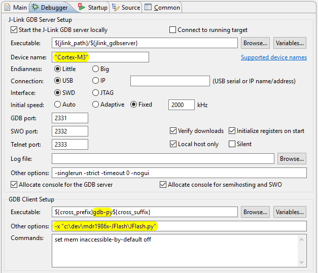

# Milandr MCU 1986x flashing with J-Link

#### What's this project for?

- Debugging on [Milandr 32-bit Cortex-М MCU](http://ic.milandr.ru/products/mikrokontrollery_i_protsessory/32_razryadnye_mikrokontrollery/)
using [GNU ARM Eclipse](http://gnuarmeclipse.github.io/)
with native [SEGGER J-Link drivers](https://www.segger.com/jlink-software.html).
- Internal EEPROM programming using [GNU toolchain](https://launchpad.net/gcc-arm-embedded).

Supported microcontrollers: **1986BE9x** (MDR32F9Qx), **1986BE1** (MDR32F1), **1986BE3**.

#### What's the problem?

Unfortunately, SEGGER still knows nothing about EEPROM programming algorithm for Milandr MCU 1986x series.

As a result you cannot use the native J-Flash utility. Moreover, you had to use [OpenOCD](http://openocd.org/)
instead of native drivers for debugging with GNU ARM Eclipse.

OpenOCD is quite good, but at present, slightly less functional, for example,
[OpenOCD debugging Eclipse plug-in](http://gnuarmeclipse.github.io/debug/openocd/)
does not support a capturing of Serial Wire Output (SWO).

Also you are able to use SEGGER [Real Time Transfer](https://www.segger.com/jlink-rtt.html) (RTT)
only with the native drivers.

#### How does it work?

- LOADER (RAMCode) implements EEPROM programming algorithm.
- GDB script on [Python](https://sourceware.org/gdb/current/onlinedocs/gdb/Python.html) `JFlash.py` redefines
  the GDB `load` command.

#### Any limits?

__Windows__: Some GDB commands do not allow to quote filenames within `""`, so you can NOT use space characters
in `JFlash` installation path.

It has not been tested on Linux yet...

## How to...

<!-- MarkdownTOC autolink="true" bracket="round" depth=0 style="unordered" autoanchor="false" -->

- [How to program EEPROM using GNU toolchain](#how-to-program-eeprom-using-gnu-toolchain)
- [How to debug using GNU ARM Eclipse](#how-to-debug-using-gnu-arm-eclipse)
- [How to check the program integrity in EEPROM at runtime](#how-to-check-the-program-integrity-in-eeprom-at-runtime)

<!-- /MarkdownTOC -->

#### How to program EEPROM using GNU toolchain

- Install [SEGGER J-Link Software](https://www.segger.com/jlink-software.html), tested with `5.10`..`6.12`.
- Install [GNU toolchain](https://launchpad.net/gcc-arm-embedded), tested with `4.9-2015-q3`.
- Install Python 2.7 ([32 bit](https://answers.launchpad.net/gcc-arm-embedded/+faq/2601)) and
  set [`PYTHONHOME`](https://docs.python.org/2/using/cmdline.html#environment-variables) and
  [`PYTHONPATH`](https://docs.python.org/2/using/cmdline.html#environment-variables) environment variables.
- You may need to add GNU toolchain path into `PATH` environment variable manually.

You have to run the next command to programming EEPROM:
```
JFlash.bat <BIN_FILE>
```
This batch file starts J-Link GDB server at first, then runs GDB client to execute `program_from_shell`
function of JFlash script with the name of
[the raw binary file](http://gnuarmeclipse.github.io/plugins/features/#extra-build-steps)
as argument, something like this:
```
start /B JLinkGDBServerCL -if swd -device "Cortex-M1" -endian little -speed 2000 -port 2331 -singlerun
arm-none-eabi-gdb-py --batch -x JFlash.py -ex "py program_from_shell('yourapp.bin')"
```

#### How to debug using GNU ARM Eclipse

- Install [GNU ARM Eclipse](http://gnuarmeclipse.github.io/install/).
- Configure [J-Link debugging Eclipse plug-in](http://gnuarmeclipse.github.io/debug/jlink/).

- Into the debugger launch configuration `GDB SEGGER J-Link Debugging → Debugger`, you should:
  1. Set `"Cortex-M1"` or `"Cortex-M3"` (depends on MCU) into `J-Link GDB Server Setup → Device name`.
  2. Replace `gdb` with `gdb-py` in `GDB Client Setup → Executable`.
  3. Add `-x JFlash.py` into `GDB Client Setup → Other options` (you have to use the full path to the script).



- Into `GDB SEGGER J-Link Debugging → Startup`, you should select
  `Load Symbols and Executable → Load Executable → Use file`, and add the name of
  [the raw binary file](http://gnuarmeclipse.github.io/plugins/features/#extra-build-steps).
  If you select an ELF file for loading, the script will try to convert it into the raw binary using
  `arm-none-eabi-objcopy`.


The `JFlash.py` script redefines GDB `load` command, so when Eclipse calls `load`, the script runs instead.

The script creates `JFlash.log` in the folder of the current project, also LOADER prints a trace into RTT.
To launch RTT client (terminal) you should uncomment its call in the batch file.

At the end, if the mapfile of our binary exists, `JFlash.py` sets the address of RTT structure,
and you are able to interact with the loaded binary using RTT client.
There is an example of RTT usage into [`mdr1986x_RTT`](https://github.com/in4lio/mdr1986x-pack-repo/tree/master/source/Example_Projects_Eclipse/mdr1986x_RTT) project.

#### How to check the program integrity in EEPROM at runtime

The `JFlash.py` script writes CRC-32 of the binary file `aligned(4)` right after the image in EEPROM,
it could be compared with CRC-32 that is being calculated by the program.
